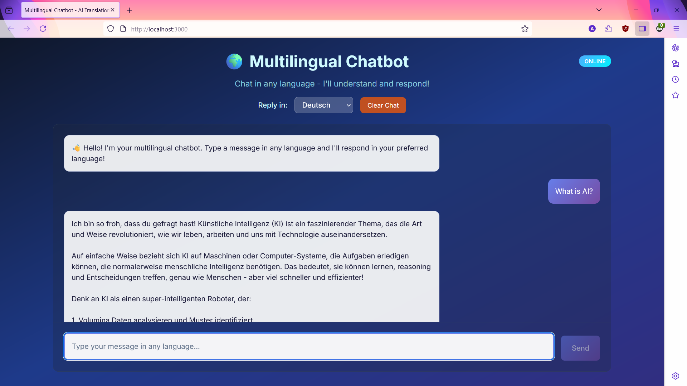
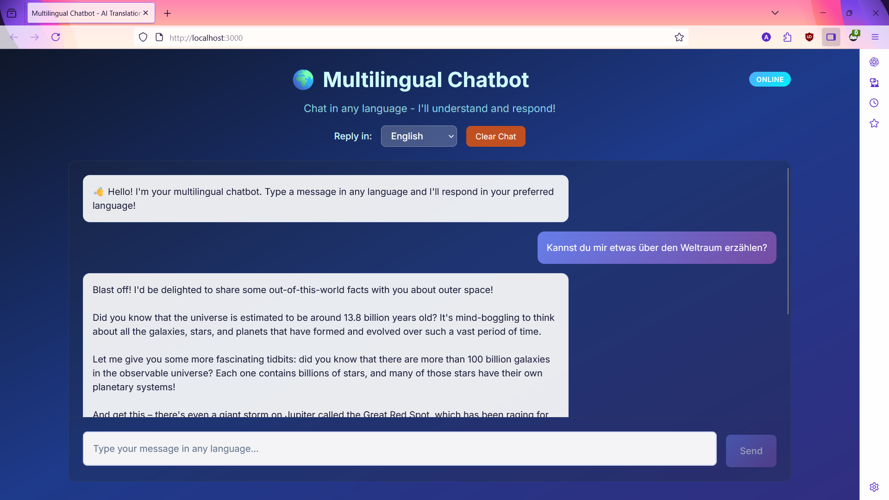

# Multilingual Chatbot

A simple multilingual chatbot built with Node.js using Ollama's Llama3:latest model and TypeScript.

## Features
- Supports multiple languages
- Powered by Ollama Llama3:latest
- Written in TypeScript
- Easy to run and extend

## Installation

1. Clone the repository
2. Run `npm install` to install dependencies
3. Run `npm run dev` to run

